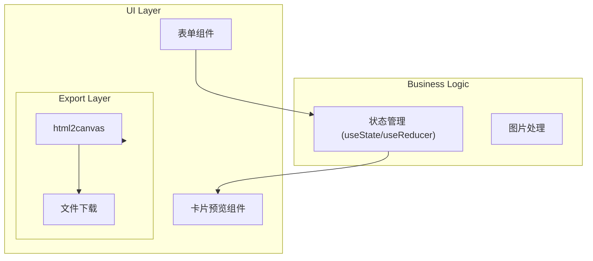
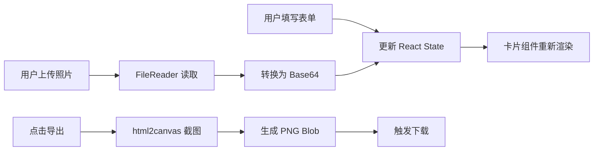

## Product Overview

创建一个 React Web 应用，用于生成 HLTV Top 20 风格的 CS2 职业选手卡片图片。用户可以通过表单填写选手数据、上传选手照片，最终导出高质量 PNG 图片。

## Core Features

- **选手信息表单**：支持填写选手姓名、ID、国籍、战队、排名等基础信息
- **照片上传**：支持上传选手照片，自动裁剪适配卡片布局
- **数据统计输入**：填写 Rating、击杀数、MVP 次数、EVP 次数等关键数据
- **战队成就展示**：输入年度重大赛事冠军、亚军等成就信息
- **实时卡片预览**：表单数据实时同步到卡片预览区域，所见即所得
- **PNG 图片导出**：一键将卡片导出为高清 PNG 图片，便于分享和保存

## Tech Stack

- **前端框架**: React 18 + TypeScript
- **样式方案**: Tailwind CSS
- **图片导出**: html2canvas
- **构建工具**: Vite

## Tech Architecture

### System Architecture

采用组件化分层架构，将 UI 展示、表单逻辑、图片导出功能分离。



### Module Division

| 模块 | 职责 | 关键技术 |
| --- | --- | --- |
| **表单模块** | 收集选手信息、数据统计、成就等 | React Hook Form / 受控组件 |
| **卡片渲染模块** | 复刻 HLTV Top 20 卡片样式 | Tailwind CSS、CSS Grid |
| **图片上传模块** | 处理选手照片上传和预览 | FileReader API |
| **导出模块** | 将卡片 DOM 转换为 PNG | html2canvas |


### Data Flow



## Implementation Details

### Core Directory Structure

```
project-root/
├── src/
│   ├── components/
│   │   ├── PlayerCard/          # 卡片渲染组件
│   │   │   ├── PlayerCard.tsx
│   │   │   ├── CardHeader.tsx   # 排名、选手ID区域
│   │   │   ├── CardStats.tsx    # 数据统计区域
│   │   │   └── CardAchievements.tsx  # 成就区域
│   │   ├── Form/
│   │   │   ├── PlayerForm.tsx   # 主表单组件
│   │   │   ├── BasicInfoForm.tsx
│   │   │   ├── StatsForm.tsx
│   │   │   └── AchievementsForm.tsx
│   │   └── ImageUploader.tsx    # 图片上传组件
│   ├── hooks/
│   │   └── useExportImage.ts    # 导出图片 Hook
│   ├── types/
│   │   └── player.ts            # 类型定义
│   ├── utils/
│   │   └── exportUtils.ts       # 导出工具函数
│   ├── App.tsx
│   └── main.tsx
├── public/
│   └── assets/                  # 静态资源（国旗图标等）
├── package.json
└── tailwind.config.js
```

### Key Code Structures

**PlayerData Interface**: 定义选手卡片的完整数据结构，包含基础信息、数据统计和成就记录。

```typescript
interface PlayerData {
  // 基础信息
  rank: number;
  playerId: string;
  realName: string;
  nationality: string;
  team: string;
  photoUrl: string;
  
  // 数据统计
  rating: number;
  kills: number;
  kdDiff: number;
  mapsPlayed: number;
  rounds: number;
  
  // 荣誉统计
  mvpCount: number;
  evpCount: number;
  hltvTop20Appearances: number;
  
  // 战队成就
  majorWins: number;
  majorFinals: number;
  bigEventWins: number;
}
```

**useExportImage Hook**: 封装 html2canvas 导出逻辑，提供简洁的导出接口。

```typescript
function useExportImage(cardRef: RefObject<HTMLDivElement>) {
  const exportAsImage = async (filename: string): Promise<void> => {
    // 使用 html2canvas 截取卡片 DOM
    // 生成 PNG Blob 并触发下载
  };
  
  return { exportAsImage, isExporting };
}
```

### Technical Implementation Plan

**1. 卡片样式复刻**

- 问题：精确还原 HLTV Top 20 卡片的视觉效果
- 方案：使用 CSS Grid + Flexbox 布局，渐变背景，自定义字体
- 步骤：分析原版卡片结构 → 拆分为子组件 → 逐层实现样式

**2. 图片导出质量**

- 问题：html2canvas 导出可能模糊
- 方案：设置 scale: 2 提高分辨率，确保字体加载完成后再导出
- 关键配置：`{ scale: 2, useCORS: true, backgroundColor: null }`

### Performance Optimization

- 图片上传时进行压缩，限制最大尺寸
- 使用 React.memo 优化卡片子组件渲染
- 导出时显示 loading 状态，防止重复点击

## Design Style

采用 HLTV Top 20 官方卡片风格，深色科技感背景搭配金色/蓝色渐变强调色。整体设计追求专业电竞赛事的视觉质感。

## Page Layout

应用采用左右分栏布局：

- **左侧表单区域（40%）**：深色背景面板，包含分组折叠的表单项，便于用户逐项填写
- **右侧预览区域（60%）**：实时渲染的选手卡片，居中展示，底部放置导出按钮

## Card Design Blocks

### 顶部区域

- 大号排名数字（如 #1）置于左上角，金色渐变
- 选手 ID 大字居中，下方显示真实姓名
- 右上角显示年份标识（如 2024）

### 选手照片区域

- 选手半身照居中展示
- 背景使用战队主题色渐变
- 底部叠加国旗和战队 Logo

### 数据统计区域

- 网格布局展示 Rating、Kills、K-D Diff 等核心数据
- 数值使用大号字体，标签使用小号灰色字体
- MVP/EVP 使用奖牌图标 + 数字展示

### 成就区域

- 底部横向排列重大赛事成就
- 使用图标 + 数字简洁展示